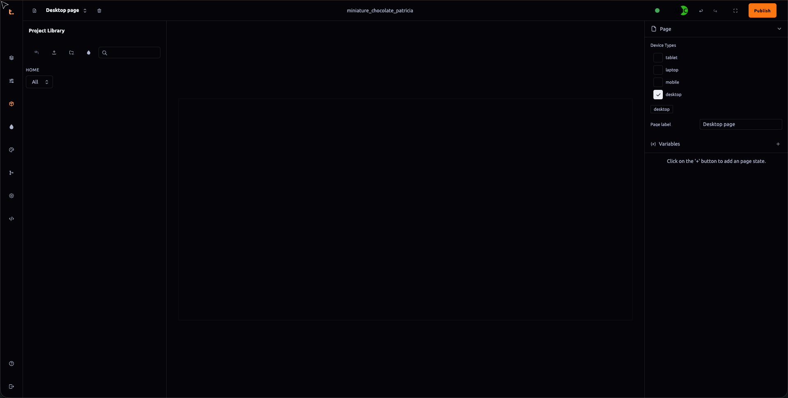

 ### Project Assets Panel Documentation

The **Project Assets** panel serves as a centralized hub for uploading and organizing various types of media files that are essential for creating rich, interactive projects within Thob Studio’s Builder tool. Below is a detailed guide on how to navigate and utilize this panel effectively:

#### Primary Functions
1. **File Upload**: This panel allows you to upload models (glb or gltf formats), images, audio files, and HDR maps directly into the project for use in visualizations, animations, or other interactive elements.
2. **Folder Management**: You can create new folders by using the provided folder creation button. Once created, you can rename these folders as needed. Additionally, assets within the panel can be moved between different folders through right-click context menu options or drag and drop functionality.
3. **Asset Material Creation**: The icon designated for creating asset materials allows you to assign and manage material properties directly from the Assets panel. This is particularly useful when setting up textures, shaders, or other visual effects on 3D models or environments within your project.

#### Advanced Features
- **Multi-Selection**: You can select multiple assets at once by holding the Ctrl key (or Cmd key on macOS) while clicking each asset individually. This feature enables batch operations and efficient management of related files.
- **Right-Click Context Menu**: Provides options to rename, delete, or move selected assets or folders, enhancing flexibility in organizing your project’s media library.
- **Drag and Drop**: Allows for intuitive movement between folders or even outside the panel into other applications if needed. This functionality supports workflow optimization by enabling drag operations directly from the Assets panel.

#### Usage Guidelines
- Ensure that all uploaded files conform to the appropriate formats (e.g., image file types, glb/gltf model formats, audio file formats) as specified in your project requirements.
- Maintain a structured folder hierarchy to keep assets organized and easily accessible based on their type or function within the project.
- Regularly review and update asset metadata such as tags, descriptions, or keywords for better searchability and retrieval when needed.

By adhering to these guidelines and utilizing the features outlined in this documentation, you can effectively manage and utilize media assets across your Thob Studio Builder projects, enhancing visual quality and interactive experiences.