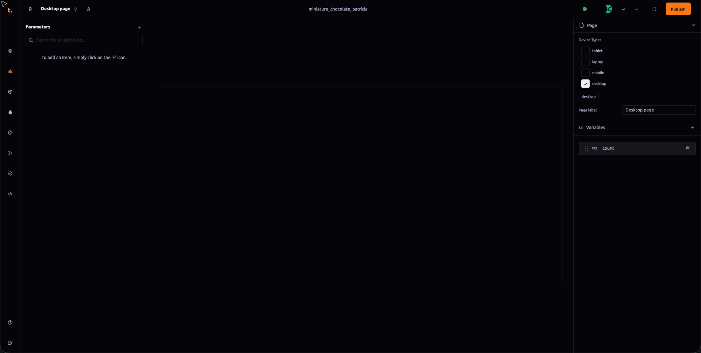

 ### Attributes Editor Panel Documentation

The **Attributes Editor** panel serves as a centralized repository for storing various types of user data within Thob Studio’s Builder tool. This section will guide you through the functionalities and properties associated with managing attributes in this panel.

#### Adding Attributes
1. **Add Attribute**: Click on the "+" button located at the top-right corner of the Attributes Editor panel to add a new attribute.
2. **Attribute Types**: Each attribute type offers different options, including boolean, string, and number types. Select the appropriate type based on the data you need to store.
3. **Custom Price Quote (CPQ) Functionality**: The CPQ feature is particularly useful for managing price quotes in different currencies. You can set individual prices for each currency, which are then accessible through the Total Price component in the Component Panel.

#### Attribute Properties
Each attribute and its options come with several properties that can be utilized throughout your project:
- **Type**: The data type of the attribute (e.g., boolean, string, number).
- **Non Editable**: Determines if the attribute value is editable or not by users.
- **Default**: Allows you to set a default value for all instances of this attribute.
- **Label**: A text field where you can enter a descriptive label for the attribute.
- **Order**: Specifies the order in which attributes are displayed within interfaces.
- **Active**: A boolean property that determines whether the attribute is active or not.
- **Description**: Provides a brief description or notes about the attribute’s purpose or usage.
- **SKU (Stock Keeping Unit)**: Unique identifier for each product, typically used for inventory management and tracking.
- **Slug**: Automatically generated from the label; can be used as a unique string representation of the attribute within the system.
- **Price (CPQ)**: Allows you to set custom prices that are currency-specific, which can then be displayed using the Total Price component.
- **Thumbnail**: Selects an image from your uploaded assets, useful for representing attributes visually in interfaces or summaries.
- **Meta**: Stores additional JSON formatted data that can be used for more complex attribute configurations or metadata not covered by other properties.

By leveraging these properties and functionalities within the Attributes Editor panel, you can efficiently manage and utilize various types of user-defined data throughout your project's interface elements and interactions.