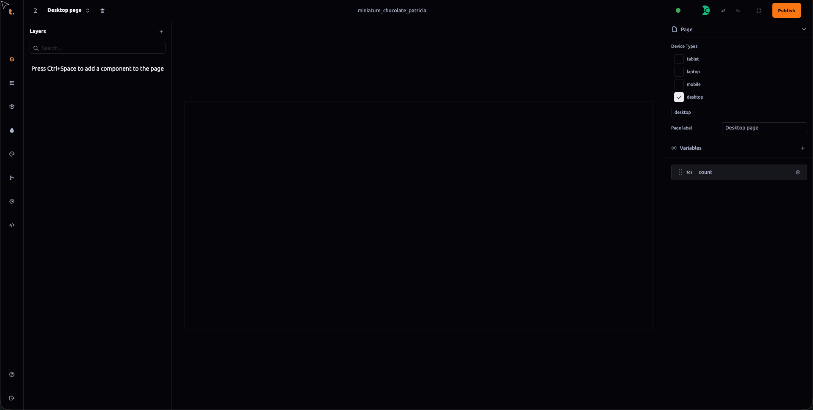
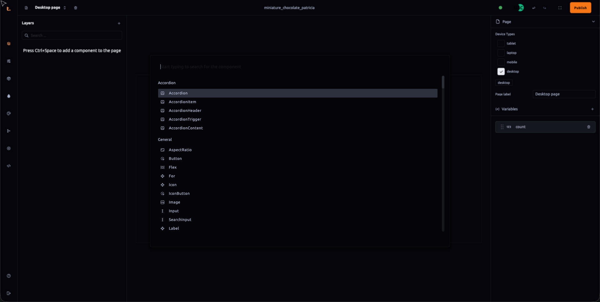

 ### Components Outliner Documentation

The components outliner within Thob Studio’s Builder tool serves as an organized inventory of all pre-built and customizable UI elements, 3D models, and interactive components that can be utilized to construct a project. This section will provide detailed information on how to access and use these components effectively:

#### Accessing Components
1. **Adding Components**: You can add components either by clicking the "+" icon or pressing `Ctrl+Space`. The available options include UI panels, react three fiber components, and custom components that are part of Thob Studio’s library.

2. **Component Composition**: Many components need to be composed together to achieve a desired effect. For example, an accordion is made up of `<Accordion.Root>`, `<Accordion.Item>`, `<Accordion.Header>`, `<Accordion.Trigger>`, and `<Accordion.Content>`.

#### UI Panel Components
- **Accordian**: Accordian is a composable UI component that organizes content into expandable and collapsible sections. [[accordian]]
- **Aspect Ratio**: Ensures that the content maintains a consistent aspect ratio based on device or design specifications. [[aspect-ratio]]
- **AssetLoadProgress**: Displays loading progress during asset load times, providing feedback to users about ongoing processes. [[asset-load-progress]]
- **Avatar**: Represents a user with an image, often clickable to navigate to a profile page. [[avatar]]
- **Button**: Triggers actions like submitting forms, opening dialogs, or toggling settings. [[button]]
- **Checkbox**: Allows users to select multiple options from a set where zero or more selections are allowed. [[checkbox]]
- **ComponentVariant**: Switches between different component styles for flexible UI and visual design options. [[component-variant]]
- **ComponentVariantItem**: Supports turning on and off the visibility of components as needed within a project structure.
- **Context Menu**: Appears when clicking on an element, offering secondary navigation or actions. [[context-menu]]
- **Collapsible**: [[collapsible]]
- **CurrencyLabel**: Displays the current currency from global app state, useful for consistent financial visualizations across different sections of an application. [[currency-label]]
- **Dialog**: A modal window used to display important information, make critical decisions, or enter additional data. [[dialog]]
- **Dropdown Menu**: A menu that appears when clicking on an element, offering multiple options in a compact format. [[dropdown]]
- **Flex**: [[flex]]
- **Hover Card**: Appears as a tooltip when hovering over an item, providing detailed information without cluttering the UI. [[hovercard]]
- **Icon Button**: A button with only an icon, used for actions that do not require additional text (e.g., closing a dialog). [[iconbutton]]
- **Popover**: Similar to a hover card but appears when clicking on an element, often used for detailed information. [[popover]]
- **Progress**: Indicates the progress of a task visually (e.g., loading bars, circular progress indicators). [[progress]]
- **Radio Group**: Multiple radio options grouped together under a common label, useful for mutually exclusive choices. [[radio-group]]
- **Select**: A dropdown menu to select a single option from a list, similar to a native HTML `<select>` element. [[select]]
- **Scroll Area**: [[scroll-area]]
- **Sheet**: [[sheet]]
- **Slider**: Allows users to select values within a specific range through sliding controls. [[slider]]
- **Show**: Conditionally renders children based on specified conditions, providing dynamic content visibility control within applications. [[show]]
- **Spinner**: Indicates progress in an indeterminate way, typically circular (e.g., during data fetching). [[spinner]]
- **Switch**: A toggle button that switches between two states (on/off, yes/no, etc.). [[switch]]
- **Tabs**: A set of layered sections under a tab bar where only one tab is visible at a time. [[tabs]]
- **Text Area**: A multi-line input field for longer text inputs like comments, reviews, etc. [[text-area]]
- **Text Field**: A single-line input field used for entering data (e.g., names, addresses). [[text]]
- **Toggle**: [[toggle]] 
- **Tooltip**: Appears when hovering over an element, providing a brief description or additional information without cluttering the UI. [[tool-tip]]
- **TotalPrice**: Reads and displays total price in various currencies directly from store information, offering real-time pricing visuals at point-of-sale locations or similar interfaces. [[total-price]]

#### Canavs Components
- **For**: Implements a loop to repeat elements, useful in scenarios where you need multiple instances of the same component. [[for]]
- **InitialLoader**: Provides visual feedback during asset loading to enhance user experience by showing when assets are being loaded. [[initial-loader]]
- **GltfModel**: Allows importing glb or gltf models and attaching project materials directly to the model’s meshes for realistic rendering. [[gltf-model]]
- **Environment**: Represents a physical environment using image-based lighting (IBL), enhancing realism in 3D scenes by simulating light conditions effectively. [[environment]]
- **OrbitControls**: Enables interactive camera controls such as orbiting, dollying, and panning, providing dynamic perspectives on the scene. [[orbitcontrols]]
- **PerspectiveCamera**: A perspective projection camera suitable for rendering a 3D scene that mimics human vision. [[perspective-camera]]
- **DirectionalLight**: Emits light from a specific direction like sunlight, useful for creating realistic shadows in outdoor scenes or directional effects. [[directional-light]]
- **Billboard**: Ensures text or images attached to it face the viewer, maintaining visibility regardless of camera angle. [[billboard]]
- **ContactShadows**: Implements contact shadows, enhancing depth perception by showing how lights fall on objects from below. [[contact-shadows]]
- **AccumulativeShadows**: Supports soft shadows and is optimized for performance by only accumulating when necessary, making it suitable for detailed lighting setups without significant overhead. [[accumulative-shadows]]
- **RandomizedLight**: Jiggles a set of lights around to create realistic shadow effects, typically used in conjunction with `AccumulativeShadows`. [[randomized-light]]
- **PointLight**: Emits light from a single point in all directions, ideal for localized illumination like lamps or fireplaces. [[point-light]]
- **SpotLight**: Emits light along a cone path, useful for spotlight effects such as car headlights or theatrical stage lighting. [[spot-light]]
- **HemisphereLight**: Provides atmospheric lighting with color fading based on the sky and ground colors, adding depth to scenes without casting shadows. [[hemisphere-light]]
- **ProjectMaterial**: Allows editing of project materials directly within the hierarchy, enabling quick material adjustments without external assets. [[project-material]]
- **Texture**: Base class for textures used in project materials, providing maps that can be applied to enhance visual properties of 3D objects. [[texture]]
- **TablerIcon**: Utilizes Tabler icons as components, allowing easy integration and use of vector icons within the application. [[tabler-icon]]
- **Spinner**: Includes predefined loaders like MoonLoader, ScaleLoader, PuffLoader, BarLoader, BeatLoader for various loading animations. [[spinner]]
- **CanvasTexture**: Creates a texture from a canvas element, useful for dynamic content display on 3D objects directly from HTML elements. [canvas-texture]
- **GlobalAudio**: Adds background audio to the entire scene, providing immersive auditory experiences within applications. [[global-audio]]
- **PositionalAudio**: Adjusts audio based on the position of the viewer relative to the 3D object, enhancing spatial audio realism in interactive environments. [[positional-audio]]
- **MaterialVariant**: A React component that manages material variants for 3D objects, enhancing customization options without significant code modifications. [[material-variant]]
- **Hotspot**: Allows attaching HTML elements like buttons or labels to specific points in a 3D scene, improving interactivity and user engagement. [[hotspot]]
- **PointOfInterest**: Defines specific spots within a 3D scene that the camera can move to for focused views, useful for navigation aids and debug purposes. [[point-of-interest]]
- **PointOfInterestControls**: Manages camera movements between different points of interest in a scene, ensuring smooth focus transitions across defined waypoints in applications. [[point-of-interest-controls]]

This comprehensive guide should help users navigate through the various components available within Thob Studio’s Builder tool, enabling them to efficiently create engaging and interactive digital experiences using both 2D UI panels and dynamic 3D models.