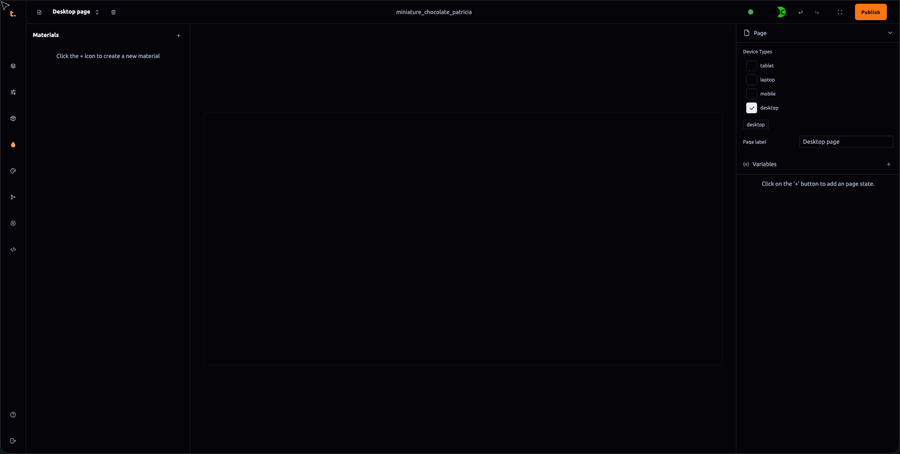

 ### Material Outliner Documentation

The **Material Outliner** is a feature within Thob Studio’s Builder tool that allows users to manage and organize material properties at a project-level scale. This section will provide detailed information on how to access, use, and benefit from the Material Outliner for efficient material asset management.

#### Accessing the Material Outliner
To create a new material within your project, follow these steps:
1. **Click the "+" Button**: Navigate to the area where you want to add a new material and click on the "+" button located at the top of the interface. This action will initiate the creation process for a new material asset.
2. **Name Your Material**: Once the “Create Material” dialog appears, provide an appropriate name for your material based on its intended use or type (e.g., “Wood Texture”, “Metal Finish”).
3. **Define Properties**: Configure the properties of the material by selecting from a range of options including color, texture maps, metallicness, roughness, emissive settings, and more. These properties can be adjusted using numeric inputs or integrated sliders for fine-tuning.
4. **Save Your Material**: After setting up your material’s attributes, click “Create” to finalize the creation process. The new material will now appear in the Material Outliner panel where it can be assigned directly to models within the project hierarchy.

#### Utilizing the Material Outliner
The Material Outliner provides several functionalities that enhance organization and management of materials:
- **Project-Level Materials**: By creating materials at a project level, you ensure consistency across multiple parts of your scene or model without having to reassign properties each time. This is particularly useful for maintaining visual themes throughout the entire project.
- **Material Variants**: For cases where different instances of a material are needed (e.g., varying textures on different objects), use the “Variant” feature within the Material Outliner to create distinct material settings that can be easily switched between in real-time or during runtime based on context or user preference.
- **Material Editing**: Directly edit material properties using intuitive interfaces and tools provided, allowing for quick adjustments without needing to access external editing software. This includes changing color tints, applying textures, tweaking lighting responses, and more.

#### Best Practices
To optimize the use of the Material Outliner, consider the following best practices:
- **Consistent Naming Conventions**: Assign clear and consistent names to materials for easy identification and retrieval when needed in scripts or during asset management tasks.
- **Version Control**: Whenever making significant changes to material properties, ensure that older versions are preserved within your project’s version control system to allow rollback options if issues arise from updates.
- **Testing Before Deployment**: Always test new material setups thoroughly before applying them directly into the game engine or final deployment settings to avoid visual bugs or performance degradation in the application.

By following this documentation, you will be able to effectively manage and manipulate materials within your Thob Studio Builder project using the Material Outliner tool, thereby enhancing workflow efficiency and production quality.