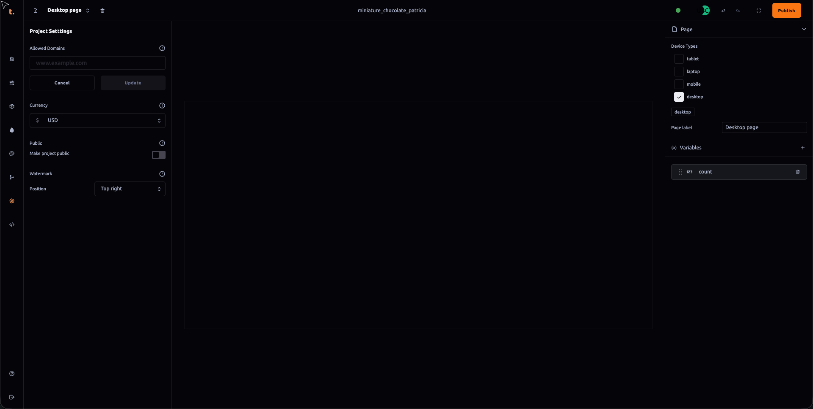

 ### Project Settings Panel Documentation

The **Project Settings** panel serves as a central hub for configuring various settings related to your project within Thob Studio’s Builder tool. This section will provide an overview of the functionalities available in this panel, including domain management, currency settings, and public visibility options.

#### 1. Domain Management
- **Single Domain Configuration**: As of now, the Project Settings panel allows you to configure only one domain name under which your project can be published. This is useful for maintaining a consistent online presence and ensuring that all users accessing your project are directed to the correct URL.
- **Domain Addition/Modification**: If you need to add or modify the domain configuration in the future, you will have the option to do so through this panel. Ensure that any changes made comply with the organization's policies regarding web addresses and DNS settings.

#### 2. Currency Settings
- **Default Currency Selection**: Within the Project Settings panel, there is a drop-down menu where you can set a default currency for your project. This setting influences how financial transactions are displayed and processed within the platform. Common currencies typically available in this field include USD, EUR, GBP, JPY, etc.
- **Currency Conversion Options**: Depending on the features provided by Thob Studio’s Builder tool, there might be options to integrate currency conversion services directly into your project dashboard for a more comprehensive financial management experience.

#### 3. Public Visibility Settings
- **Making the Project Public**: By toggling the "Make the project public" option in the settings panel, you allow all users of the Builder tool access to view and potentially fork your project. This feature is particularly useful if you want to share templates or other resources with a broader audience for collaboration, further development, or as a community resource.
- **Forking and Collaboration**: When your project is publicly visible, other users can "fork" your project by creating a derivative work based on the original source code, designs, content, etc. This ability to clone and build upon your project fosters innovation and community engagement around your product or service offerings.

#### Best Practices and Considerations
- **Domain Security**: Ensure that all domain configurations are secure and comply with relevant legal and regulatory standards to prevent unauthorized access and potential security risks.
- **Currency Compliance**: Choose a default currency that is compliant with local regulations, supports the currencies of your primary market, or aligns with the preferred payment methods used by your target audience.
- **Community Engagement**: Carefully consider who you allow to fork and collaborate on your project to ensure that it remains aligned with your business objectives and does not expose sensitive information or intellectual property to unintended users.

By utilizing the Project Settings panel effectively, you can optimize the configuration of your project for optimal functionality and user engagement within Thob Studio’s Builder tool ecosystem.