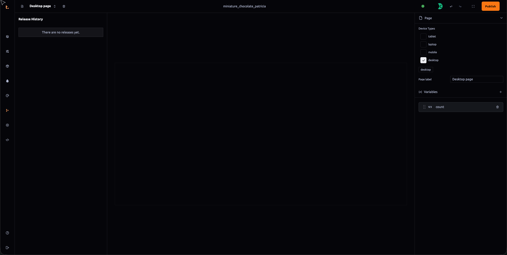

 ### Project Version Panel Documentation

The **Project Version** panel serves as a central repository for tracking and managing version history within Thob Studio’s Builder tool. This panel is inspired by Git-like functionality, although currently limited in its branch management capabilities. Below are detailed guidelines on how to use the Project Version panel effectively:

#### Release History
The primary function of the **Release History** section is to document and track every significant change or update made within your project over time. Each point in the timeline represents a unique version, similar to how branches work in Git but without the flexibility of multiple independent branches.

1. **Version Creation**: Every time you publish a new version (or checkpoint) in the timeline, it creates a new entry. This is analogous to creating commits in Git, where each commit represents a distinct state of the project at that point in time.
2. **Viewing Versions**: You can view the detailed changes and updates made between versions by expanding each timeline entry. This feature allows you to easily trace what modifications were introduced with each update.
3. **Diff View**: The "Diff" feature provides a side-by-side comparison of two specific versions, showing exactly which files or elements have been added, modified, or deleted since the previous version.

#### Future Functionality (Planned)
While the current implementation does not support multiple branches, Thob Studio plans to expand this functionality in future updates:
- **Branching and Merging**: In future versions, you will be able to create separate branches from a base version, allowing for parallel development without affecting the main timeline. Branches can then be merged back into the main timeline once developments are complete or deemed stable.
- **Version Comparison Across Branches**: Ability to compare versions between different branches to identify and resolve conflicts in changes or feature implementations before finalizing merges.

#### Best Practices
To make the most out of version control within Thob Studio’s Builder tool:
- **Regular Backups**: Regularly export your current project state as a new version when making significant structural, design, or functional changes to ensure that you can revert to any previous stable version if necessary.
- **Descriptive Commit Messages**: Use clear and descriptive commit messages (or version notes) for each entry in the timeline to help identify what changes were made easily later on. This aids both team members and yourself in understanding the context of updates without needing extensive documentation every time a new version is published.
- **Consistent Naming Conventions**: Apply consistent naming conventions for versions or branches that are meaningful within your project environment, which helps maintain order in the timeline and makes it easier to navigate through large histories.

By adhering to these guidelines and utilizing the Project Version panel as outlined, you can effectively manage and track changes across multiple versions of your projects without the complexity typically associated with Git-based version control systems.