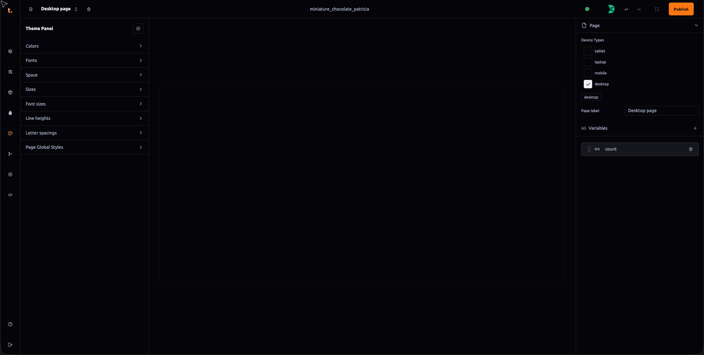
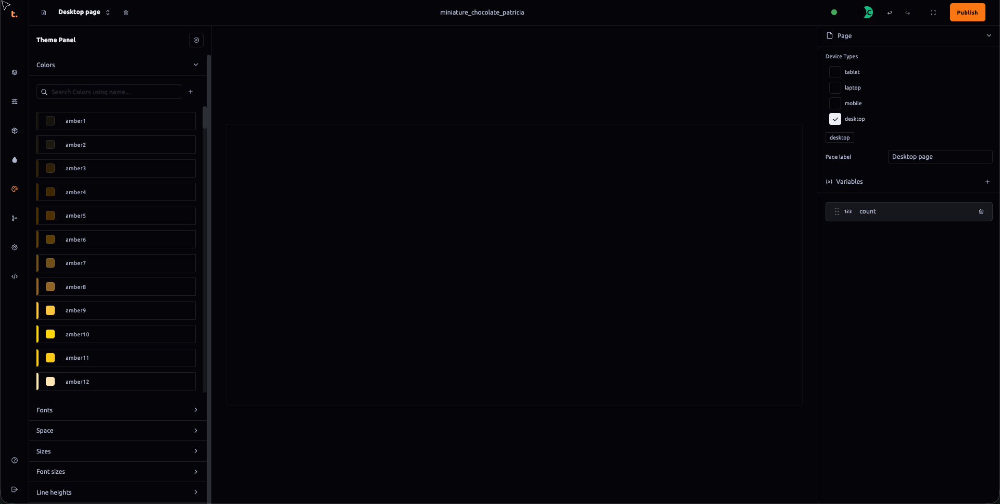

 ### Project Theme Panel Documentation

The **Project Theme** panel within Thob Studio’s Builder tool serves as a centralized repository for managing visual themes, including color schemes, typography, and global styles. This section will guide you through the functionalities available in this panel to ensure efficient customization of your project's appearance.

#### Settings Icon Functionality
1. **Reset Theme**: Clicking on the settings icon (gear symbol) allows you to reset the theme back to its default state, which erases all custom variables and resets them to initial values. This action is useful for starting fresh or as a fallback option when needed.
2. **Import Light/Dark Theme**: You can import predefined light or dark themes by switching between these options. Please note that if you switch from one type of theme to another, any data specific to the current theme will be lost, so it's advisable to export your customizations before making such changes.

#### Accordion Items and Their Functions
The panel includes several accordion items each serving a distinct purpose:
- **Colors**: Depending on the selected theme type (e.g., light or dark), you can view and manage color variables by searching through them using the search field. To add your own custom color variable, click the "+" icon and input the appropriate hex/rgba/hsla value.
- **Fonts**: This item allows you to import fonts directly from Google Fonts. You will see a list of all available fonts here; select multiple ones by clicking on the import font dropdown. Imported fonts are then assigned names that can be integrated into your text fields, allowing for easy customization or augmentation of default typography settings.
- **Space**: Manages spacing variables such as margins, paddings, and gaps between elements. You can add custom space values to adjust layout parameters.
- **Size**: Encompasses size variables including width, height, and border radius, which you can modify according to your design needs.
- **Font Size**: Controls the font sizes across all typographic elements in your project. Adjust these settings to maintain visual consistency.
- **Line Heights**: Manages the spacing between lines of text, affecting readability and overall layout balance.
- **Letter Spacings**: Adjusts the space between characters in text, influencing legibility and aesthetic appeal.
- **Page Global Styles**: Allows you to set global CSS properties that apply across the entire page or application, such as custom font families not available on Google Fonts. You can import these fonts directly through this panel for a unified visual style.

#### Adding Custom Variables
For each accordion item, you have the option to add your own variables:
- **Colors**: Click the "+" icon and enter the hex/rgba/hsla code manually or use color pickers provided for easier value selection.
- **Fonts**: Select from imported fonts by entering the desired font family name into the text field. If you prefer not to override defaults, append it to the existing list of font families in a comma-separated format.
- **Space, Size, Font Size, Line Heights, Letter Spacings**: Use input fields provided for adding custom values specific to these settings.
- **Page Global Styles**: Enter your CSS code directly into this field to apply global styles as needed.

#### Best Practices and Considerations
- **Backup Customizations**: Before making significant changes or switching themes, it's advisable to export the current theme settings to avoid data loss.
- **Consistency**: Ensure that all custom variables adhere to the overall design language of your project to maintain consistency in visual identity.
- **Testing**: Test color schemes and typography extensively across different devices and browsers to ensure compatibility and accessibility standards are met.

By following this documentation, you will be able to effectively manage and customize themes within Thob Studio’s Builder tool using the Project Theme Panel, enhancing your project's visual appeal and usability.