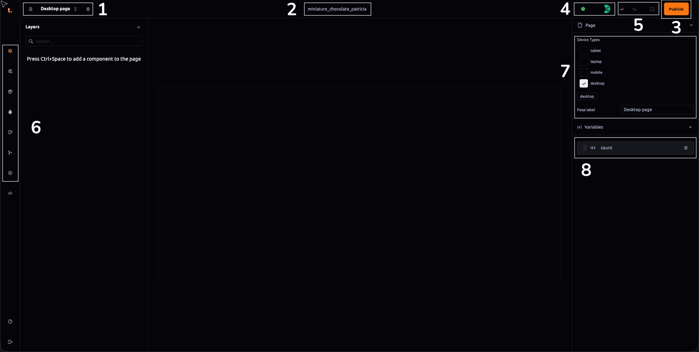

### Project Editing Interface

#### 1. Page Management Icons
- **Create New Pages**: Allows users to add new pages to their project effortlessly by simply clicking on this icon. The newly created page will appear in the dropdown menu, making it easy for users to navigate between different pages within the same project.
- **Delete Current Page**: Provides a simple way to remove the current page from the project when it is no longer needed or if it needs to be replaced with another. This action is irreversible and should be used carefully.

#### 2. Project Name Change
- Allows users to update the name of their project. Renaming projects can help in better organization and identification of different projects within the platform, especially when dealing with multiple ongoing projects.

#### 3. Publish Button
- The publish button is a crucial feature that enables users to make their project live or available for public viewing. It often involves finalizing all necessary settings, resolving any issues identified during preview mode, and ensuring compliance with platform policies before going live.

#### 4. Status Indicators
- **Connected Indicator (Green Dot)**: Indicates the connectivity status of the user’s session to the project. A green dot signifies a successful connection; if it turns red or disappears, it may indicate issues that need troubleshooting.
- **Collaborator Count Icons**: Shows the number of people currently working on the same project as indicated by icons. This feature is particularly valuable in multi-user collaborative environments where real-time updates and visibility into team activities are essential for smooth workflow management.

#### 5. Undo/Redo Actions & Canvas Maximizer
- **Undo Button**: Allows users to revert their last action, which can be useful after making unintended changes or when experimenting with different edits.
- **Redo Button**: Provides a way to reapply an action that was previously undone, useful for correcting mistakes or exploring alternate design paths without permanently losing any work.
- **Maximize Canvas Button**: Enables users to expand the visible area of the editing canvas to maximize screen space and better view and edit their project content in greater detail.

#### 6. Project Panel Components
- **Component Outliner**: Displays a hierarchical list of all components within the current page, facilitating easy navigation and organization of elements like text blocks, images, buttons, or other interactive items. [[component-outliner]]
- **Attributes Editor**: Allows users to modify properties such as size, position, color, and behavior settings for each component listed in the Component Outliner. [[attributes-outliner]]
- **Project Assets**: Manages all media files (images, videos, fonts, etc.) used within the project. This includes uploading new assets and managing existing ones efficiently. [[assets-outliner]]
- **Material Outliner**: If applicable, this feature outlines different materials or themes available to customize the visual appearance of components, helping in maintaining a consistent look across various elements within the project. [[material-outliner]]
- **Theme Panel**: Offers a selection of pre-defined design templates or color schemes that can be applied globally or selectively to parts of the page for quick and easy styling adjustments without extensive coding. [[theme-outliner]]
- **Project Versions**: Tracks changes made to the project, allowing users to revert back to previous versions if needed when experimenting with edits that might not yield desired results. [[project-version-outliner]]
- **Project Settings**: Contains various configuration options such as privacy settings, user permissions, and other advanced project management features. [[project-setting-outliner]]

#### 7. Device Type Selection & Page Label
- Allows users to specify how the current page should be displayed across different device types like tablets, laptops, desktops, and mobile devices. By selecting multiple devices or checking all available options, the page can adapt its layout and content appropriately for each platform. The default label "Desktop page" can be changed according to specific needs or branding requirements.

#### 8. Global Page Variables
- Enables users to create variables of different types (String, Boolean, Number, Array) that can be controlled programmatically through functions within the project. This feature supports advanced functionalities and dynamic content updates based on these variable states, enhancing interactivity and data management capabilities beyond basic static page construction.

This detailed breakdown should provide a comprehensive understanding of how Thob Studio’s Builder tool facilitates efficient and effective project editing and management, tailored for both beginners and experienced users seeking to create engaging digital experiences across multiple devices.