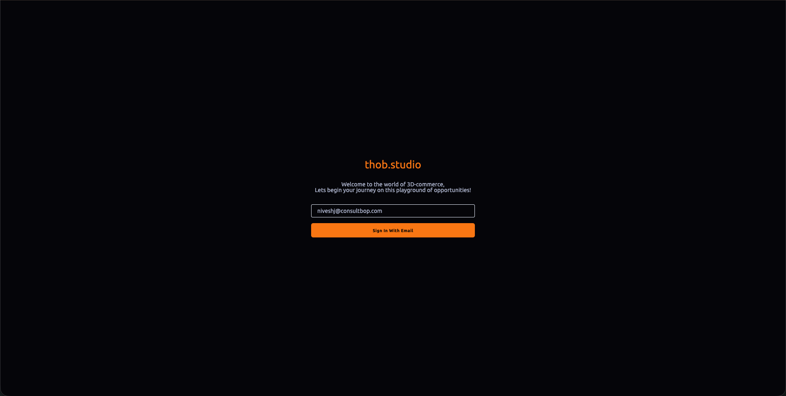
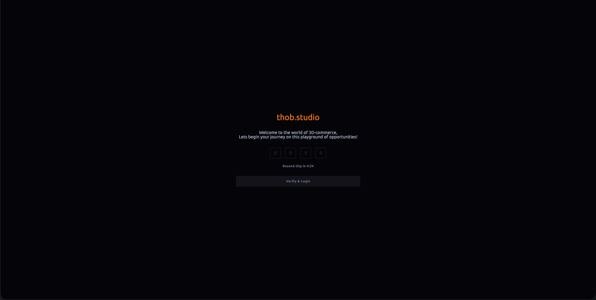
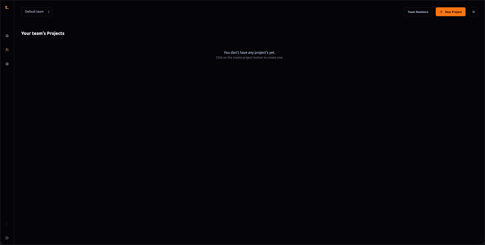
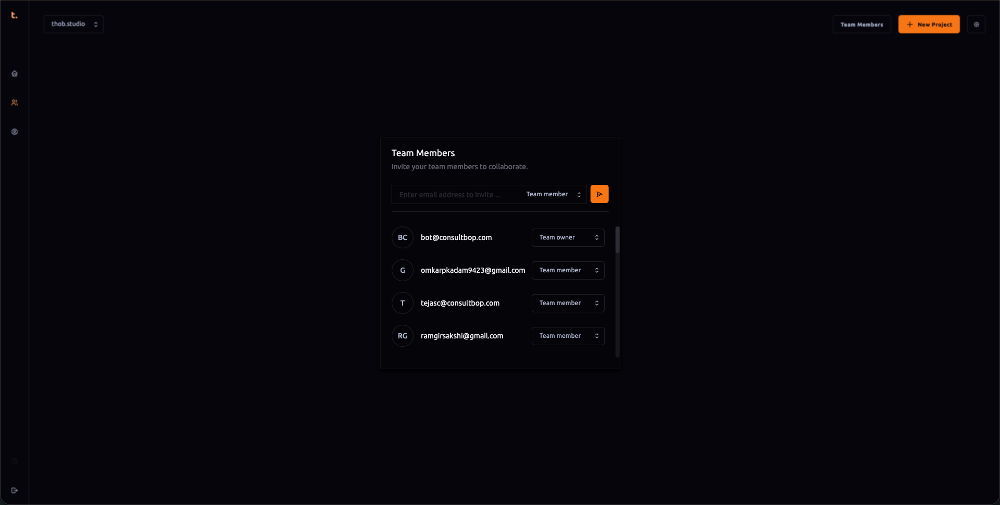

# Getting-Started

### Logging into Builder
To access the builder interface:
1. Navigate to [builder.thob.studio](https://builder.thob.studio).
2. Enter your email address to initiate the login process. You will receive a One-Time Password (OTP) via email.
3. Upon entering the correct OTP, you will be logged into the builder interface.

### Default Team Assignment
When you log in for the first time, you are automatically assigned to a default team named "default". This team is created specifically for your user account and serves as a starting point for all personal or collaborative projects.

### Defining Documentation: Managing Team Members
In Thob Studio’s Builder tool, effective management of team members is crucial for collaboration and access control. Here's how to invite team members and assign roles:

#### Inviting Team Members
1. **Access the Team Management Section:** From your account dashboard or within a project, navigate to the "Team" section where you can manage all collaborators.
2. **Invite New Members:** Click on the "Invite Member" button and enter the email address of the person you wish to invite. This action will send an invitation with instructions to join the team.
3. **Assign Roles:** After inviting a member, assign them one of the following roles based on their level of access:
   - **Team Owner**: Has full administrative control over the team including adding/removing members and assigning roles.
   - **Team Admin**: Can manage content within the team but does not have direct publishing capabilities.
   - **Team Member**: Can view and edit project details but cannot publish any changes.
   - **Team Editor**: Can review, comment on, and make minor edits to documents; however, they are not authorized to publish or modify significant aspects of the content without approval from a Team Admin or higher.

#### Role-Based Access Levels
- **Team Owner** can: Invite new members, assign roles, customize team settings, and manage all administrative tasks within the team.
- **Team Admin** can: Perform most actions that a regular team member can do but are limited from managing other admins or changing permissions for other team members. They also have access to certain analytics reports based on predefined access levels.
- **Team Member** has read access and can contribute comments, edit minor details, and view project progress under specific guidelines.
- **Team Editor** can review content changes, make suggestions, and perform limited edits but does not have the authority to publish or save major updates independently. They must submit these for review by a Team Admin or higher before they are published.

### Customizing Access Levels
While Thob Studio’s Builder tool currently offers predefined roles with set permissions based on level of access, future versions might incorporate more flexible customization options that enable users to tailor access levels according to specific project needs and workflows. This feature would allow teams greater autonomy in managing internal structures without being constrained by rigid hierarchical limitations.

### Conclusion
Thob Studio’s Builder tool provides a robust platform for collaborative documentation through its user-friendly interface and integrated team management features. By following the steps outlined above, users can efficiently invite collaborators, assign roles, and manage access levels to ensure that each member operates within defined permissions while maintaining smooth workflow dynamics across all projects.