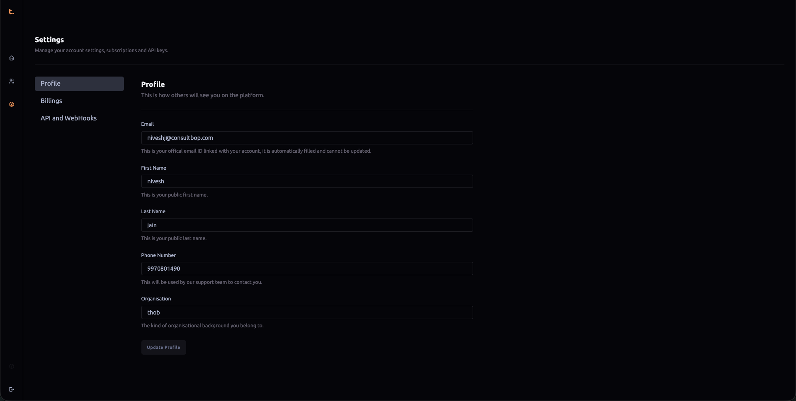
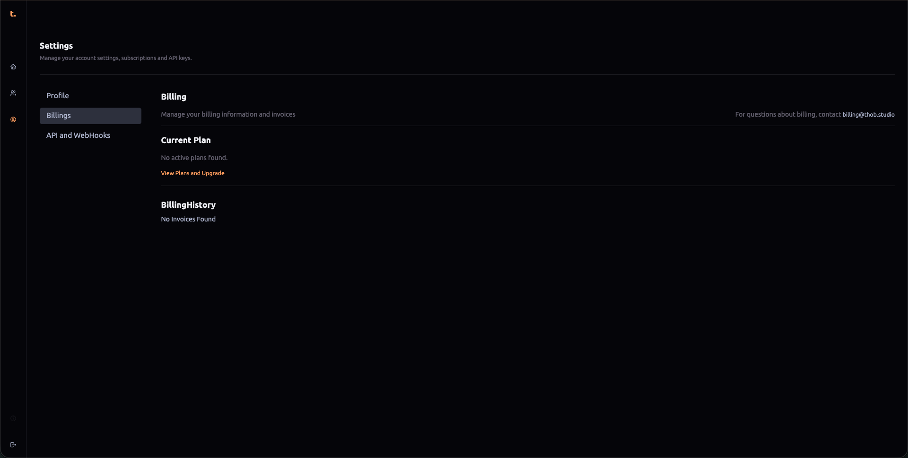
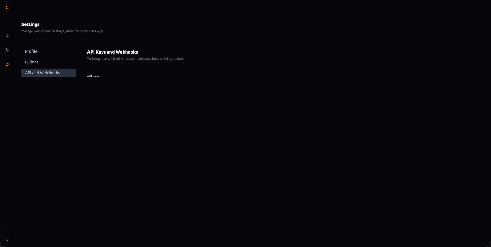

### Profile Section
This section allows users to manage their public profile information visible across the platform:
- **Email**: The email address is automatically filled in when creating an account and cannot be updated directly. It serves as a primary means of communication for notifications, updates, and important account details.
- **First Name** & **Last Name**: Users can specify their public first and last names here to ensure that others see the correct name associated with their account.
- **Phone Number**: This field is used by the support team to contact the user in case of any issues or for follow-ups related to the account or services provided through Thob Studio’s Builder tool.
- **Organization**: Users can specify the type of organizational background they belong to, which might be useful for categorizing users based on their professional roles within companies or the nature of their business operations.

### Billing Section
The billing section includes information about different subscription plans that users can choose from:
1. **Crawl Plan** - Designed for small start-ups and enthusiasts, this plan includes:
   - 1 project
   - 10,000 page views per month
   - Support for up to 2 users
   - Versioning capabilities
   - Integration with channels (specific details not mentioned)
   - Community support

2. **Walk Plan** - Ideal for small and medium-sized businesses looking to enhance their business:
   - 3 projects
   - 50,000 page views per month
   - Support for up to 3 users
   - Integration with channels (specific details not mentioned)
   - Basic analytics
   - Email support

3. **Jog Plan** - Designed for medium and large businesses seeking competitive advantages:
   - 6 projects
   - 1,00,000 page views per month
   - Support for up to 5 users
   - Integration with channels (specific details not mentioned)
   - Advanced analytics
   - Email support

4. **Sprint Plan** - Targeted at corporates and large businesses:
   - 10 projects
   - 1,50,000 page views per month
   - Support for up to 10 users
   - Integration with channels (specific details not mentioned)
   - Premium analytics
   - Dedicated account manager
   - Email & chat support
   - Custom watermark options

### API and Webhooks
For each plan, there is an option to generate an API key from the API & Webhooks section. This key is necessary for integrating the platform with various external platforms such as WooCommerce, Shopify, PrestaShop, etc. The provided plans offer varying levels of access based on the number of projects, page views, and user support that are included in each plan:
- **API Key**: Each plan provides an API key which can be used to enable seamless integration with other software platforms for a more comprehensive suite of business tools and capabilities.

### Conclusion
Thob Studio’s Builder tool offers flexible subscription plans tailored to meet the needs of businesses ranging from small start-ups to large corporations. By providing detailed insights into each plan, including the number of projects supported, page views allowed, user capacity, analytics features, support options, and more, users can select a plan that aligns with their specific business requirements and growth stages. The API key management in the billing section is crucial for integrating third-party services and enhancing the functionality of Thob Studio’s Builder tool within various platforms.